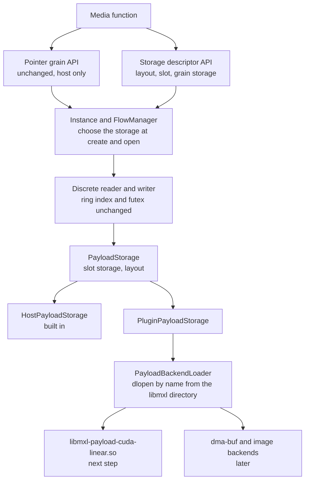

<!-- SPDX-FileCopyrightText: 2025 Contributors to the Media eXchange Layer project. -->
<!-- SPDX-License-Identifier: CC-BY-4.0 -->

# Grain Payload Storage

This page describes how MXL separates where a grain payload is stored from the ring buffer logic, so that payloads can live in memory other than host shared memory. The first target is `video/v210` and `video/v210a` in CUDA device memory. The design also has to allow devices that share their memory as dma-buf, and sharing exported Vulkan images, OpenGL textures and CUDA arrays.

It covers what is implemented on the `feature/grain-storage-descriptors` branch, the principles behind it, and the work that follows. The design merges this branch with the CUDA work in [PR #653](https://github.com/dmf-mxl/mxl/pull/653).

## Current state

The changes below are implemented. None of them changes the behaviour of existing applications or the on-disk format of flows that use host memory.

### Storage descriptors and host storage

Discrete flow data now owns a `PayloadStorage` object (`lib/internal/include/mxl-internal/PayloadStorage.hpp`). The Posix discrete reader and writer ask it for the address of a slot instead of computing it from the grain header. `FlowManager` attaches a `HostPayloadStorage` when it creates or opens a discrete flow. That storage describes the existing layout, where the payload of each grain follows its header in the grain's shared memory segment.

The public API in `mxl/flow.h` gains these types:

- `mxlPayloadStorageType`: how a slot is addressed. The only value is `MXL_PAYLOAD_STORAGE_HOST_POINTER`.
- `mxlGrainStorageLayout` (512 bytes): the layout shared by all slots of a flow. It holds:
  - the storage type;
  - the device index in the calling process, and the device UUID, which identifies the device across processes;
  - the slot count;
  - the offset, size and pitch of each plane;
  - reserved space for descriptions specific to a storage type, such as pixel formats and format modifiers.
- `mxlGrainPlaneLayout` (32 bytes): one plane.
- `mxlGrainStorage` (256 bytes): the storage of one slot. It is a tagged union, with `host.pointer` for host storage. The reserved part leaves room for one handle per plane and a synchronization object.

It also gains these functions:

| Function | Purpose |
|---|---|
| `mxlFlowReaderGetStorageLayout`, `mxlFlowWriterGetStorageLayout` | Read the layout once after creating the reader or writer. |
| `mxlFlowReaderMapSlots`, `mxlFlowWriterMapSlots` | Map the storage of every slot into the calling process, and fill an array with the description of each slot, indexed by slot. Call once before reading or writing grains. |
| `mxlFlowReaderGetGrainSlot` | Wait for a grain and return the slot that holds it. A timeout of 0 returns without waiting. |
| `mxlFlowWriterOpenGrainSlot` | Open a grain and return the slot that holds it. Commit and cancel are unchanged. |

A reader that handles any storage type works like this:

1. Create the reader, and read the layout with `mxlFlowReaderGetStorageLayout`.
2. Call `mxlFlowReaderMapSlots` with an array of `slotCount` entries. The library does all the work needed to access the payload in this process, such as importing device memory or receiving file descriptors.
3. Set up its own per-slot resources from the array, for example Vulkan imports, V4L2 buffers or CUDA surface objects, and keep them in a table indexed by slot.
4. In the read loop, call `mxlFlowReaderGetGrainSlot`, and look the returned slot up in its table. The per-grain call only runs the ring buffer logic. It does not touch the payload storage.

A writer works the same way with `mxlFlowWriterMapSlots` and `mxlFlowWriterOpenGrainSlot`. The slot is always `index % slotCount`, but applications use the value the library returns, so that the mapping stays defined by the library.

The arrays the application keeps are copies that it owns. Handles in them, such as file descriptors, are owned by the library and stay valid until the reader or writer is released. If a read returns `MXL_ERR_FLOW_INVALID`, for example because the writer recreated the flow, the descriptions are stale: the application releases the reader, creates a new one and maps it again.

The existing pointer functions (`mxlFlowReaderGetGrain*`, `mxlFlowWriterOpenGrain`) behave as before for host storage. For any other storage type they return `MXL_ERR_UNSUPPORTED_OPERATION`.

The descriptor sizes are checked at compile time, since they cannot change once released. Tests are in `lib/tests/test_grain_storage.cpp`.

### Internal backend interface and loader

Storage types other than host memory are implemented by backend libraries that ship with the SDK. They are not part of libmxl. This change adds the interface between libmxl and those libraries, and the code that loads them. No backend is shipped yet.

- `lib/internal/include/mxl-internal/PayloadBackendAbi.h` defines the interface.
  - It is a versioned table of C functions: `prepare`, `open`, `destroy`, `slotStorage`, `describeLayout` and `mapSlots`.
  - `prepare` and `open` receive the backend's options from the writer or reader as JSON object text. Options specific to one kind of storage, such as a CUDA device UUID, are never part of the interface itself.
  - The flow description passed to a backend includes the plane geometry (plane count, slices per grain, and slice sizes), so that a backend allocating images or device buffers can size them.
- `lib/internal/include/mxl-internal/PayloadBackend.hpp` declares three classes:
  - `PayloadBackendLoader` finds and validates backend libraries.
  - `PluginPayloadStorage` implements `PayloadStorage` on top of a backend instance.
  - `PayloadStorageError` carries the status code a backend returned.
- The tests build three backend libraries from `lib/internal/tests/payload_backends/`:
  - A valid backend that keeps the payload in a file.
  - The same backend reporting a wrong name.
  - A library without the entry point.

  `lib/internal/tests/test_payload_backend.cpp` uses them to check, without a GPU:
  - loading and validation;
  - prepare in a temporary directory, publishing by rename, and opening;
  - explicit mapping of all slots, and mapping on first access when the application did not map;
  - layout completion.

A backend named `cuda-linear` is the library `libmxl-payload-cuda-linear.so`. libmxl searches the directories listed in the `MXL_PAYLOAD_PLUGIN_PATH` environment variable, separated by colons, then the directory that holds libmxl, and uses the first file it finds. If that file is not a valid backend, loading fails and later directories are not searched. Relative directories are ignored, and so is the variable in setuid and setgid processes. The library must export `mxlGetPayloadBackendApi`, implement the interface version of libmxl, report the name it was loaded under, and report a storage type that libmxl knows. Libraries are loaded on first use and stay loaded until the process exits.


### Storage describes its own layout

libmxl builds a default layout from the flow configuration. In it, the planes follow each other without padding, and the pitch of each plane equals its slice size. The storage then completes that layout through `PayloadStorage::describeLayout`, or `describeLayout` in the backend interface:

- It sets the storage type, the device index and the device UUID.
- It may change the offset, size and pitch of planes, for example when a device chose the pitch of the buffers it allocated.
- It may fill the part of the reserved space defined for its storage type.

libmxl then checks the result:

- The storage must not change the version, the size, the slot count or the plane count.
- It must report its own storage type.
- Every plane must be able to hold all its slices at the reported pitch.

Host storage keeps the default layout, so host flows report exactly what they did before.

### Flows that use a backend

A writer selects the payload storage with the `payload` object of the options of `mxlCreateFlowWriter`:

```json
{"payload": {"backend": "cuda-linear", "deviceUuid": "GPU-88064374-43da-caf5-b332-be5fb39bf2e6"}}
```

libmxl interprets one key, `backend`, which names the backend library. Without it, or with `host`, the payload is in the built-in host storage. There is no default backend for other storage: a writer that wants device memory, dma-buf or images names the backend, and an empty name is an error. libmxl does not restrict which data formats a backend holds. It passes the data format to the backend, which rejects the formats it cannot store.

The deprecated `mxlCommonFlowConfigInfo.payloadLocation` and `deviceIndex` play no part in this. libmxl leaves them at 0 and -1 for every flow. Readers learn the storage and the device from `mxlGrainStorageLayout`.

All other keys belong to the backend. libmxl passes them to it as a JSON object, and the backend validates them. In the example, `deviceUuid` is an option of the CUDA backend. A dma-heap backend would take a heap name instead, and a backend for a capture card a device node. The built-in host storage accepts no other keys.

Backends for GPUs, such as CUDA and Vulkan, identify devices by UUID, not by index. [GPUs are identified by UUID](#gpus-are-identified-by-uuid) explains why. Each backend resolves the UUID to its own device in each process. `mxlGrainStorageLayout.deviceUuid` is what identifies the device across processes, and `mxlGrainStorageLayout.deviceIndex` is that device's index in the calling process.

Readers pass options to the backend of the flow the same way, in the `payload` object of the options of `mxlCreateFlowReader`, for example `{"payload": {"deviceUuid": "GPU-…"}}` to access a CUDA payload on another GPU of the same machine. Readers cannot select the storage, so `backend` is not accepted. Flows with the built-in host storage ignore the other keys, so an application can pass the same reader options to every flow.

Errors:

- Invalid `payload` options return `MXL_ERR_INVALID_ARG`, whether libmxl or the backend rejects them.
- A backend that is not installed returns `MXL_ERR_UNSUPPORTED_OPERATION`. So does device memory for a data or audio flow, and any backend for an audio flow.
- A flow whose payload is held by a backend has exactly one writer. A second writer for it returns `MXL_ERR_CONFLICT`, and so does a writer that asks for a backend when the flow already exists with built-in storage.

A flow created with a backend differs from a host flow in four ways:

- It uses flow data version 2 (`FLOW_DATA_VERSION_PAYLOAD_BACKEND`). SDK releases that only know version 1 refuse to open it, instead of reading past the end of a grain file.
- Its grain files hold only the 8 KiB grain header.
- Its directory holds `payload.json`, written by libmxl. It records the version of its format, the backend name and the storage type the backend reports. The backend writes the files it needs next to it, for example the exported memory handle.
- The backend prepares its storage in the temporary directory, before the rename that publishes the flow. If the backend cannot be loaded or fails, nothing is published.

A reader opens such a flow by loading the backend named in `payload.json` and opening its storage, which does not map anything. If the backend cannot be used in the reader's process, for example because it is not installed or its device runtime is missing, the reader is still created and can read the flow metadata. `mxlFlowReaderGetStorageLayout` and `mxlFlowReaderMapSlots` then return `MXL_ERR_UNSUPPORTED_OPERATION`.

The tests use the file backed test backend (`test-file`) to run this whole path without a GPU. It is built next to the flow test executable, because libmxl only loads backends from the directory of the binary that contains its code, and never installed.

## Principles

### The public API only grows

No existing function, structure or constant changes. Host flows keep flow data version 1 and their exact on-disk layout. An application built against an earlier release keeps working without being rebuilt. Every new public element can be ignored by applications that only use host memory.

### Only the payload moves

Grain headers (`mxlGrainInfo`), the flow data, the head index and the futex used for synchronization always stay in host shared memory. Ring buffer operation, slot selection by index (`mxlGetCurrentIndex`, `mxlTimestampToIndex`) and the synchronization protocol do not depend on where the payload is. A slot is one ring buffer entry, and the grain at index `i` is in slot `i % slotCount`.

### The SDK owns the backends

The backend interface is internal. Applications cannot register backends through the API. A flow names its backend, and libmxl loads the library of that name from the directories of `MXL_PAYLOAD_PLUGIN_PATH` or from its own directory. The variable lets a system install the SDK's backends somewhere else, or a developer test a backend without installing it. It does not make the backend interface public. Backend names are restricted to lowercase letters, digits and hyphens, so a name cannot form a path.

This has two consequences:

- libmxl does not link CUDA, Vulkan or any other vendor library. A backend library links what it needs, and is only loaded when a flow uses it.
- The interface can change between releases without breaking applications. libmxl refuses a backend that implements another interface version, so a backend built for another release is not loaded. Publishing the interface later, if the community wants third-party backends, is an addition to the public API.

### Descriptors record their format

A writer and a reader of a flow can come from different SDK releases, for example when they run in different containers. They can then load different builds of a backend. Each file that describes a payload therefore records the version of its format, and a reader refuses a file in a format it does not know:

- libmxl writes `"version"` in `payload.json`. A reader that finds another version fails with `MXL_ERR_UNSUPPORTED_OPERATION` and does not open the flow, since it cannot trust the rest of the file.
- Each backend writes a version in its own files, such as `payload.cuda.json`, and refuses files in another format. Mapping the slots then fails with `MXL_ERR_UNSUPPORTED_OPERATION`.

A change that readers of the old format could still read, such as a new optional field, keeps the version. Any other change increments it.

### GPUs are identified by UUID

This applies to backends for GPUs. CUDA and Vulkan both number devices in an order that depends on the process and its environment, and both give each device a UUID. Other backends name their device the way their API does: a dma-heap backend by heap name, a backend for a capture card by its device node, such as `/dev/video0`, and a DRM backend by its render node. For those backends, `mxlGrainStorageLayout.deviceUuid` is all zeros and the device indices are -1.

A flow is created in one process and read in others, often in other containers. A device has to be named the same way in all of them, and a device index does not do that. An index is only the position of a device in the list that one device API returns in one process:

- The CUDA runtime orders devices by speed unless `CUDA_DEVICE_ORDER=PCI_BUS_ID` is set, while `nvidia-smi` orders them by PCI bus. The same GPU can be device 0 for CUDA and GPU 1 for `nvidia-smi`, in the same process.
- `CUDA_VISIBLE_DEVICES` hides devices and numbers the remaining ones from 0. Container runtimes and the Kubernetes device plugin use it, or pass only the assigned GPUs into the container, so every container sees its GPUs as devices 0, 1, and so on.
- Other device APIs, such as Vulkan and NVML, enumerate devices in their own order.

For example, on a machine with two GPUs, a writer pod assigned the second GPU and a reader pod assigned the first both see their GPU as CUDA device 0. If the flow recorded "device 0", the reader would conclude that it is on the same GPU as the writer, and the import would fail or use the wrong device. With the UUID, the reader finds that the writer's GPU is not visible to it, and reports it.

A UUID is assigned to the device itself. It is the value `nvidia-smi -L` prints and `cudaDeviceProp::uuid` reports, and Vulkan reports the same kind of identifier in `VkPhysicalDeviceIDProperties::deviceUUID`. It does not depend on enumeration order, on which devices a process can see, or on the API that reports it. So:

- Writer and reader options of GPU backends name devices by UUID.
- The backend records the UUID of the device that holds the payload with the flow, and `mxlGrainStorageLayout.deviceUuid` reports it.
- Each backend translates the UUID to a device index in each process, only for its own calls to the device API.
- The device index MXL reports, `mxlGrainStorageLayout.deviceIndex`, is valid only in the process that reports it, and only for the API of the backend. The flow configuration records no device index.

### Options belong to the backend that uses them

libmxl only interprets what every storage has in common: where the payload lives and which backend holds it. Anything else, such as a CUDA device ordinal, a dma-heap name or a V4L2 device node, is passed to the backend, which validates it. A new kind of storage can therefore add its options without changes to libmxl, the backend interface or the public API. It also keeps concepts of one device family out of code that serves all of them: a CUDA device index means nothing to a dma-buf backend, which hands file descriptors to the application for it to import into its own device.

### Describe slots once

The storage of a flow is described in two parts. The layout is shared by all slots. Each slot also has a description that stays constant. Applications map all slots once, and set up their own per-slot objects from the descriptions, such as CUDA surface objects, Vulkan framebuffers, V4L2 buffers or imports. After that, only a slot number is exchanged per grain. For image and device buffer types this is required, because those per-slot objects are expensive to create.

### One plane model for every storage type

A plane is described by an offset, a size and a pitch within the memory object that holds it. This is the model used by DRM, V4L2 and Vulkan, so a layout translates directly into those APIs.

- Pointer based storage types (host memory, CUDA device pointers) keep all planes of a slot in one memory object. The plane offset is relative to the address in the slot description.
- Storage types that share memory through handles give one handle per plane in the slot description. The plane offset is relative to the start of that plane's object.

The plane geometry is the same for every slot of a flow.

### The storage never defines the media format

The media format says which bits the payload holds, for example v210, P210 or RGBA16 half float. It is a property of the flow. The writer declares it in the flow definition, and readers know it before they map anything, from the flow definition and `mxlFlowConfigInfo`. libmxl computes the planes, line sizes and grain size from it, whatever the storage.

The storage says where the memory is, how it is shared, and how the bits are arranged in memory: line padding, DRM format modifier, Vulkan tiling. It never changes the format. A backend supports a set of formats, and a flow whose format a backend does not support fails with `MXL_ERR_UNSUPPORTED_OPERATION`, as device memory does today for data and audio flows.

MXL does not convert between formats. A writer that produces RGBA16 half float on a GPU writes an RGBA16 half float flow, and a reader that needs v210 uses a converting media function in between, as for any two different media types. The mapping from an MXL media format to the formats of a device API, such as a DRM fourcc or a `VkFormat`, is defined by the SDK, so that every backend and application agrees on it.

### Storage describes its own layout

Memory that a device allocates follows the device's rules for alignment and pitch, which libmxl cannot know in advance. The storage therefore completes the layout, and libmxl checks it, as described above.

### The pointer API only returns host memory

The pointer functions return a payload pointer only for host storage. For other storage types they return `MXL_ERR_UNSUPPORTED_OPERATION`, so that an application written for host memory never dereferences device memory by mistake. Applications that handle other storage types use the descriptor functions, which work for every storage type, host included.

### Map explicitly, before reading

Opening a flow must not require a device, and reading grains must not add latency. The two are separated:

- Opening a reader maps nothing, and describing the layout must not map either. Tools that only read flow metadata, such as `mxl-info`, keep working on machines without a GPU.
- `mxlFlowReaderMapSlots` maps every slot at once, before the first read, so the first grain costs no more than any other.
- The per-grain functions only return a slot, and never map anything.

If a backend is asked for a slot that was not mapped, it maps on that first request. This is a fallback. The public API always maps through `mxlFlowReaderMapSlots` and `mxlFlowWriterMapSlots`.

### Publish complete flows

A backend allocates its memory and writes the files that readers need while the flow is still in its temporary directory. The rename that publishes the flow comes after that. A reader never sees a flow without its payload description. If allocation fails, the temporary directory is removed and nothing is published. Values that must refer to the published location, such as keys of a registry inside the process, are derived from the final directory, which is known before the rename.

### The SDK defines every storage type and export format

Storage types, and the formats in which memory is exported between processes, form closed sets defined by the SDK. New ones are added by the SDK, together with the backend that implements them. The loader rejects a backend that reports a storage type libmxl does not know.

## How the pieces fit



## Future work

The steps below complete the first pull request. They follow the design agreed with the CUDA work in PR #653.

1. Add the `cuda-linear` backend, built only when a CMake option enables it.
   - It makes one `cudaMalloc` for all slots of a flow, with each slot aligned to 256 bytes, and exports it once with `cudaIpcGetMemHandle`. It records the handle, the export format and the device UUID in its own file in the flow directory. Each reader then imports the memory once.
   - A reader on another GPU of the same machine maps the memory through peer access (`cudaIpcMemLazyEnablePeerAccess`).
   - Readers in the writer's own process share the allocation through a reference count. CUDA IPC cannot open a handle in the process that created it.
2. Document the commit contract: device work that writes a grain must be complete before `mxlFlowWriterCommitGrain`. Also document the ways to deploy it:
   - Same pod, same GPU: CUDA IPC.
   - Same pod, different GPU: IPC and peer access.
   - Different pods on one node: IPC with a shared domain and `hostIPC`.
   - Different nodes: fabrics.
3. Test the CUDA backend on machines with a GPU. CI keeps running the whole flow through the test backend.

### Passing file descriptors

dma-buf, exported Vulkan images and CUDA memory exported as a file descriptor all share memory through file descriptors, which cannot be stored in a file. They need a channel that the writer serves. libmxl owns this channel, so that every backend uses the same code and the same access checks:

- The writer's libmxl serves a Unix socket in the flow directory, `payload.sock`, and sends the descriptors of all slots with `SCM_RIGHTS`. The kernel limits one message to 253 descriptors (`SCM_MAX_FD`), so larger sets are sent in several messages.
- The writer process already runs an epoll thread for `DomainWatcher`, which can serve the socket.
- The socket checks each peer with `SO_PEERCRED` against the access rules of the domain.
- Connecting to a Unix socket requires write permission on the socket file, while a reader today only needs read access. The socket mode must therefore follow the read permission of the flow directory.
- A Unix socket in a tmpfs shared between containers works across pods on one node, without `hostIPC`.
- `pidfd_getfd` is not an alternative, because it requires ptrace permission, which containers usually deny.

The backend interface needs a second version for this. After `prepare`, libmxl asks the writer's backend for the descriptors to serve. In a reader, `mapSlots` receives the descriptors that libmxl read from the socket. The public API does not change.

This channel is shared infrastructure for every storage type after CUDA IPC. Only legacy CUDA IPC, whose handles are plain bytes, works without it.

## Worked example: a dma-buf backend

This section and the next work through two backends that do not exist yet, to check that the model holds for storage that is not pointer based. Gaps they reveal are listed in [What the examples show](#what-the-examples-show).

A dma-buf is a Linux file descriptor that refers to a buffer shared between devices and drivers. Capture and output cards (V4L2), GPUs (DRM, Vulkan, CUDA), video codecs and RDMA NICs can export or import them. The example backend, `dmabuf-heap`, allocates dma-bufs from a dma-heap for a writer, and hands them to readers so that each can import them into its own device.

### Configuration

The writer chooses the format in the flow definition. The storage is chosen in the flow options:

```json
{"payload": {"backend": "dmabuf-heap", "heap": "system"}}
```

- The `system` and `cma` heaps allocate system memory. What makes the flow different from a host flow is how the memory is shared, which the storage type expresses.
- `heap` is an option of the backend. It names a heap in `/dev/dma_heap`. `cma` gives physically contiguous memory, for devices without an IOMMU.
- Readers pass no backend options. The backend does not import into a device. Each application imports the descriptors into its own device.

Which format to use depends on the devices that write and read the flow. These are the most common formats with a DRM fourcc, which dma-buf importers need:

| Use | DRM format | Notes |
|---|---|---|
| 10-bit 4:2:2 production video | `DRM_FORMAT_P210` | Two planes: luma, then interleaved Cb and Cr, 10 bits in 16-bit words. The suggested default for broadcast video. It matches the Vulkan format `VK_FORMAT_G10X6_B10X6R10X6_2PLANE_422_UNORM_3PACK16`, and GPUs and CUDA handle it well. `DRM_FORMAT_Y210` is the packed alternative. |
| 8-bit 4:2:2 capture | `DRM_FORMAT_UYVY`, `DRM_FORMAT_YUYV`, `DRM_FORMAT_NV16` | The formats V4L2 capture devices most often produce. |
| Video codecs | `DRM_FORMAT_NV12` (8-bit 4:2:0), `DRM_FORMAT_P010` (10-bit 4:2:0) | What hardware decoders and encoders usually produce and consume. |
| Rendered RGB | `DRM_FORMAT_ABGR16161616F`, `DRM_FORMAT_XRGB2101010` | `ABGR16161616F` has the memory layout of Vulkan's RGBA16 half float, so the same format can be shared as a dma-buf or as a Vulkan image. |

v210 has no DRM fourcc, and most dma-buf importers cannot use it. The backend therefore rejects v210 and v210a flows, which keep using host or CUDA storage.

Each of these formats needs an MXL media type, and `FlowParser` support to compute its planes, line sizes and grain size. See [What the examples show](#what-the-examples-show).

### Creating the flow

`prepare` checks that the flow's format has a DRM fourcc, then opens `/dev/dma_heap/<heap>` and allocates one buffer per slot with `DMA_HEAP_IOCTL_ALLOC`. All planes of a slot share its buffer: a P210 buffer holds the luma plane followed by the chroma plane.

This differs from the planned CUDA backend, which makes one allocation for all slots. Importers of dma-buf take one memory object per frame: a V4L2 buffer, a DRM framebuffer or a `VkDeviceMemory`. With one buffer per slot, each slot can be imported on its own, and the plane offsets in the layout are the same for every slot.

The backend writes no file of its own. After `prepare`, libmxl takes the descriptors from the backend and serves them on `payload.sock`.

### Describing the storage

- The storage type is a new value, `MXL_PAYLOAD_STORAGE_DMABUF`.
- `describeLayout` reports the offset, size and pitch of each plane within the slot's buffer. It may pad lines, for example to the 64-byte pitch alignment many display engines need. libmxl checks that the planes still hold their lines.
- The type-specific part of the layout holds the DRM format of the flow and the format modifier the backend chose. DRM describes a buffer with one format and one modifier for all its planes:

  ```c
  typedef struct mxlDmaBufLayout_t
  {
      uint32_t drmFormat;  /* DRM fourcc of the flow's media format, as defined by the SDK */
      uint32_t reserved;
      uint64_t modifier;   /* DRM format modifier, DRM_FORMAT_MOD_LINEAR for heap buffers */
  } mxlDmaBufLayout;       /* 16 bytes of the 344 reserved */
  ```
- The slot description holds one descriptor per plane. Planes of the same buffer repeat its descriptor:

  ```c
  typedef struct mxlDmaBufGrainStorage_t
  {
      int32_t fd[MXL_MAX_PLANES_PER_GRAIN];  /* owned by libmxl, dup to keep */
      uint64_t bufferSize[MXL_MAX_PLANES_PER_GRAIN];
  } mxlDmaBufGrainStorage;                   /* 48 bytes of the 240 reserved */
  ```

### Opening and mapping

Opening a reader does nothing more than for any backend. When the application calls `mxlFlowReaderMapSlots`, libmxl connects to `payload.sock`, receives the descriptors of all slots, and passes them to the backend. The backend checks the size of each buffer with `lseek(fd, 0, SEEK_END)` and fills the slot descriptions.

The application then imports each slot once, with the plane offsets and pitches from the layout:

- V4L2: queue buffers with `V4L2_MEMORY_DMABUF` and `m.fd`.
- DRM/KMS: `drmPrimeFDToHandle`, then `drmModeAddFB2WithModifiers`.
- Vulkan: `VkImportMemoryFdInfoKHR` with `VK_EXTERNAL_MEMORY_HANDLE_TYPE_DMA_BUF_BIT_EXT`, and an image created with `VkImageDrmFormatModifierExplicitCreateInfoEXT`.
- EGL: `eglCreateImage` with `EGL_LINUX_DMA_BUF_EXT` and the plane attributes.

The pointer API returns `MXL_ERR_UNSUPPORTED_OPERATION` for dma-buf flows. A process can `mmap` a dma-buf, but CPU access has to be bracketed with `DMA_BUF_IOCTL_SYNC` for cache coherency, which the pointer API has no place for.

### Writing and committing

The writer application maps its slots with `mxlFlowWriterMapSlots` and imports them into its own device, for example as V4L2 capture buffers. For grain index `n` it queues the buffer of the slot that `mxlFlowWriterOpenGrainSlot` returns.

A dma-buf can carry fences (implicit synchronization). Before calling `mxlFlowWriterCommitGrain`, the writer either waits for its device to finish or attaches the fence of that work with `DMA_BUF_IOCTL_IMPORT_SYNC_FILE`. A reader gets the fence with `DMA_BUF_IOCTL_EXPORT_SYNC_FILE` and waits on it before its device reads. The commit function keeps its signature.

### Buffers allocated by a device

Some devices allocate their own buffers: a V4L2 driver exports them with `VIDIOC_EXPBUF`, and a GPU driver exports its allocations. In that case MXL adopts the buffers instead of allocating them.

- The application passes one descriptor per plane and slot to a new creation function, since JSON options cannot carry descriptors. This is an addition to the public API.
- The second version of the backend interface lets `prepare` accept these descriptors. The backend checks each buffer's size, and reports the offsets and pitches the device chose through `describeLayout`.
- The device must provide exactly the slot count of the flow. For V4L2 that means `VIDIOC_REQBUFS` with that count.

### Lifetime and access

A dma-buf stays alive as long as any descriptor, mapping or import of it exists, so a reader never uses memory the writer freed. If the writer stops, readers that already mapped keep valid memory but receive no new grains. New readers cannot connect to the socket, which matches the current behaviour for a flow whose writer is gone.

A dma-buf descriptor carries the access it was created with, and a reader cannot be given less than the writer has. Readers of host flows map the payload read-only. Readers of dma-buf flows can write to it. See [Open questions](#open-questions).

### Fabrics

libfabric can register a dma-buf directly with `FI_MR_DMABUF`, which is also the mainline kernel path for RDMA from GPU memory. Fabrics would register the descriptor and offset of each plane, as reported by the storage.

## Worked example: a Vulkan image backend

Vulkan images, OpenGL textures and CUDA arrays cannot be shared through CUDA IPC. What can be shared between processes is image memory created and exported by Vulkan, as an opaque file descriptor or as a dma-buf. A consumer imports it into Vulkan, into OpenGL with `GL_EXT_memory_object_fd`, or into CUDA with `cudaImportExternalMemory` and a mipmapped array. One backend for exported images therefore serves all three APIs. The example backend is called `vulkan-image`.

### Which formats an image holds

The flow definition gives the format, and the SDK maps it to a `VkFormat`. The image holds the flow's samples in that format, without conversion:

| Media format | Vulkan format | Images per slot |
|---|---|---|
| RGBA16 half float | `VK_FORMAT_R16G16B16A16_SFLOAT` | One image with one plane. The typical format for rendering and compositing. |
| RGBA8 | `VK_FORMAT_R8G8B8A8_UNORM` | One image with one plane. |
| P210 | `VK_FORMAT_G10X6_B10X6R10X6_2PLANE_422_UNORM_3PACK16` | One multi-planar image with two planes, luma then chroma. |

RGBA16 half float is the default for image flows because renderers and compositors work in it, and it holds linear light values above 1.0 for HDR content. `VK_FORMAT_R16G16B16A16_UNORM` keeps 16 bits of integer precision for values that already carry a transfer curve, and can be added as a second RGBA16 format if an application needs it.

For RGB formats, the flow definition must also say what the values mean: the colour primaries, and the transfer characteristic, such as linear light, PQ or HLG. Half float values are often linear light, while 8-bit values usually carry a transfer curve. A reader needs this to interpret the samples, and a renderer to write them.

The backend rejects formats without a Vulkan equivalent, such as v210.

### Configuration

```json
{"payload": {"backend": "vulkan-image", "deviceUuid": "8806437443dacaf5b332be5fb39bf2e6", "tiling": "optimal"}}
```

- `deviceUuid` selects the Vulkan physical device by `VkPhysicalDeviceIDProperties::deviceUUID`.
- `tiling` is `optimal`, for the driver's own layout, or `linear`. Optimal tiling can only be shared between processes that use the same driver on the same device.
- Readers pass no backend options. Each application imports the images into its own `VkDevice`, OpenGL context or CUDA context.

### Creating the flow

The backend does not know the application's Vulkan device. It therefore creates its own headless `VkInstance` and `VkDevice` on the requested physical device, and allocates there. Every user of the flow imports the memory, the writer application included.

`prepare` creates, for each slot:

- a `VkImage` with `VkExternalMemoryImageCreateInfo`, an opaque file descriptor as handle type, the `VkFormat` of the flow's media format, the frame size as extent, and storage, sampled and transfer usage;
- a dedicated, exportable allocation for that image, exported with `vkGetMemoryFdKHR`. A multi-planar image created with `VK_IMAGE_CREATE_DISJOINT_BIT` has one allocation per plane.

It also creates one exportable timeline semaphore for the flow. libmxl serves all descriptors on `payload.sock`.

### Describing the storage

- The storage type is a new value, `MXL_PAYLOAD_STORAGE_EXTERNAL_IMAGE`.
- The layout's `deviceUuid` is the Vulkan device UUID.
- The planes have no linear addressing. The backend reports offset 0, the allocation size, and pitch 0.
- The type-specific part holds what an importer needs to create an identical image:

  ```c
  typedef struct mxlExternalImageLayout_t
  {
      uint8_t driverUuid[16];      /* VkPhysicalDeviceIDProperties::driverUUID */
      uint32_t vkFormat;           /* VkFormat of the flow's media format */
      uint32_t width;
      uint32_t height;
      uint32_t usage;              /* VkImageUsageFlags */
      uint32_t flags;              /* VkImageCreateFlags, for example VK_IMAGE_CREATE_DISJOINT_BIT */
      uint32_t tiling;             /* VkImageTiling */
      uint32_t handleType;         /* VkExternalMemoryHandleTypeFlagBits */
      uint32_t imageLayout;        /* VkImageLayout the image is always kept in */
      uint64_t allocationSize[MXL_MAX_PLANES_PER_GRAIN]; /* one entry, or one per plane of a disjoint image */
      uint64_t drmModifier;        /* for dma-buf export, otherwise 0 */
  } mxlExternalImageLayout;        /* 88 bytes of the 344 reserved */
  ```

- The slot description holds one memory descriptor, or one per plane of a disjoint image, and the descriptor of the flow's timeline semaphore. The semaphore descriptor is the same in every slot, because slot descriptions are the only place that carries handles.

### Importing

Each Vulkan, OpenGL and CUDA import function takes ownership of the descriptor it is given. The application therefore duplicates the descriptor from the slot description with `dup`, and passes the copy, as the rule that libmxl owns its handles requires.

- Vulkan: check that `deviceUuid` and `driverUuid` match the application's device, which opaque descriptors require. Create an image with the parameters from the layout and `VkExternalMemoryImageCreateInfo`. Allocate its memory with `VkImportMemoryFdInfoKHR` and `VkMemoryDedicatedAllocateInfo`, then bind it. Import the semaphore with `vkImportSemaphoreFdKHR`.
- OpenGL: `glCreateMemoryObjectsEXT`, `glImportMemoryFdEXT`, then `glTextureStorageMem2DEXT` with the matching internal format, for example `GL_RGBA16F`.
- CUDA: `cudaImportExternalMemory`, then `cudaExternalMemoryGetMappedMipmappedArray` with the matching channel description, for example `cudaCreateChannelDescHalf4()`, and a surface object on level 0. Import the semaphore with `cudaImportExternalSemaphore` as a timeline semaphore.

### Synchronization

The timeline semaphore of the flow uses the grain index as its value.

1. The writer submits the GPU work that renders grain `n`, and has it signal value `n + 1`.
2. The writer commits the grain right away, without waiting for the GPU. `mxlFlowWriterCommitGrain` keeps its signature.
3. A reader that gets grain `n` from `mxlFlowReaderGetGrainSlot` makes its GPU work wait for value `n + 1` before it reads.

Grain indices only grow, because the writer cannot open an index at or below the last one it committed. A skipped grain therefore never blocks a reader: a later signal releases all waits for lower values.

Images are always kept in the layout reported in `imageLayout`, for example `VK_IMAGE_LAYOUT_GENERAL`. Each side transfers ownership to and from `VK_QUEUE_FAMILY_EXTERNAL` with a barrier around its access, and never transitions the layout, because work from another API or process bypasses Vulkan's layout tracking.

Partial grains do not apply. With optimal tiling a line is not a contiguous range of memory, and the semaphore signals whole grains. The writer commits each grain with all slices valid.

### Lifetime

Exported memory and semaphores stay alive as long as any process holds an import of them. If the writer stops, readers that already imported keep valid images. New readers cannot connect to the socket.

### Fabrics

Images with optimal tiling cannot be sent with RDMA. Images with linear tiling, exported as dma-buf with `DRM_FORMAT_MOD_LINEAR`, could be registered like any dma-buf.

## What the examples show

Most of the model holds for both backends without change:

- The public API: map all slots once, then exchange a slot number per grain. Image and dma-buf imports are expensive, so describing slots once is what makes them usable.
- The split between a layout shared by all slots and constant slot descriptions, and a closed set of storage types defined by the SDK.
- The descriptor sizes. The largest type-specific description, for images, uses 88 of the 344 reserved bytes of the layout. Four plane descriptors and a semaphore use less than 64 of the 240 reserved bytes of a slot description.
- Identifying devices by UUID. Vulkan needs a device UUID and a driver UUID, and a dma-heap needs neither.
- Passing backend options through libmxl: `heap`, `deviceUuid` and `tiling` need no change to libmxl or its interfaces.
- Layouts completed by the storage, for pitches that a device or driver chooses.
- The commit function. dma-buf fences and a timeline semaphore keyed on the grain index both work without a new argument.
- Preparing the storage before publishing, the one-writer rule, and `payload.json`.

The examples also reveal gaps, to close when these backends are implemented:

1. The file descriptor channel, and a second version of the backend interface through which a writer's backend hands its descriptors to libmxl and a reader's backend receives them.
2. `makeGrainStorageLayout` checks every plane as a linear range of lines. Images with optimal tiling have no pitch. The check has to apply only to storage types with linear addressing, and image types describe their planes in their type-specific part.
3. Partial grains only make sense for linear storage. Readers need to know whether a flow supports them. A flags field in the layout, taken from its reserved space, can say so without breaking compatibility.
4. For backends that allocate on their own device, the writer application also imports its slots. `mxlFlowWriterMapSlots` already covers that, and the documentation has to say that it is required for these storage types.
5. Buffers allocated by a device need a new creation function in the public API, and a `prepare` that accepts descriptors.
6. Readers of dma-buf and image flows can write to the payload, while readers of host flows map it read-only.
7. OpenGL has no timeline semaphores. `GL_EXT_semaphore` only has binary semaphores, so OpenGL readers either wait on the CPU, or the backend adds a binary semaphore per slot.
8. Every import function takes ownership of the descriptor it is given. The documentation of each storage type has to repeat that applications duplicate descriptors before importing them.
9. Neither backend uses v210. Both need new MXL media types, such as P210 and RGBA16 half float, with `FlowParser` support for their planes, line sizes and grain size, and colour and transfer information for RGB formats. Device memory is then no longer limited to v210 and v210a.
10. The backend interface has to pass the flow's media format to the backend, and a backend has to be able to reject formats it does not support. This is an internal change. The public API stays the same.

## Later pull requests

- The GStreamer test source and sink with device memory, from PR #653.
- RDMA from device memory in fabrics: CUDA memory registered with `FI_HMEM_CUDA`, and dma-buf registered with `FI_MR_DMABUF`, using the storage type and device reported by `PayloadStorage`. Fabrics rejects device memory until then.
- The file descriptor channel and the second version of the backend interface, followed by the dma-buf backend and then the image backend, as worked out above.
- Buffers supplied by the application: dma-bufs allocated by a device, or CUDA memory from an application's memory pool. The backend would still own export and import, and would check the memory before using it.

## Open questions

- How a writer chooses memory that every reader's device can use. Some devices need physically contiguous memory, others a specific format modifier, and readers usually connect after the flow is created. The first answer is that the writer chooses, for example with a heap name in the flow options, and readers that cannot import the memory get an error.
- Whether it is acceptable that readers of dma-buf and image flows can write to the payload, as long as every process in a domain is trusted, or whether those storage types need a separate read-only copy for untrusted readers.
- How applications that use v210 and applications that use GPU formats interoperate. Most MXL applications read and write v210 today. Flows in P210 or RGBA16 half float need converting media functions between the two, and the community may want to agree on a small set of formats for device memory.
- How the new formats are named in the flow definition. NMOS describes raw video with `video/raw` and its sampling and bit depth parameters, while MXL uses `video/v210` today.
- How OpenGL readers synchronize with image flows: waiting on the CPU, or a binary semaphore per slot in addition to the timeline semaphore.
- Whether buffers supplied by the application are needed in the first release, or can wait for a concrete use case.
- Whether third-party backends should ever be allowed. If so, the backend interface would become public, which is an addition to the public API.
- The minimum kernel version for `DMA_BUF_IOCTL_EXPORT_SYNC_FILE` and `DMA_BUF_IOCTL_IMPORT_SYNC_FILE`. It needs to be confirmed; it is believed to be Linux 6.0.
